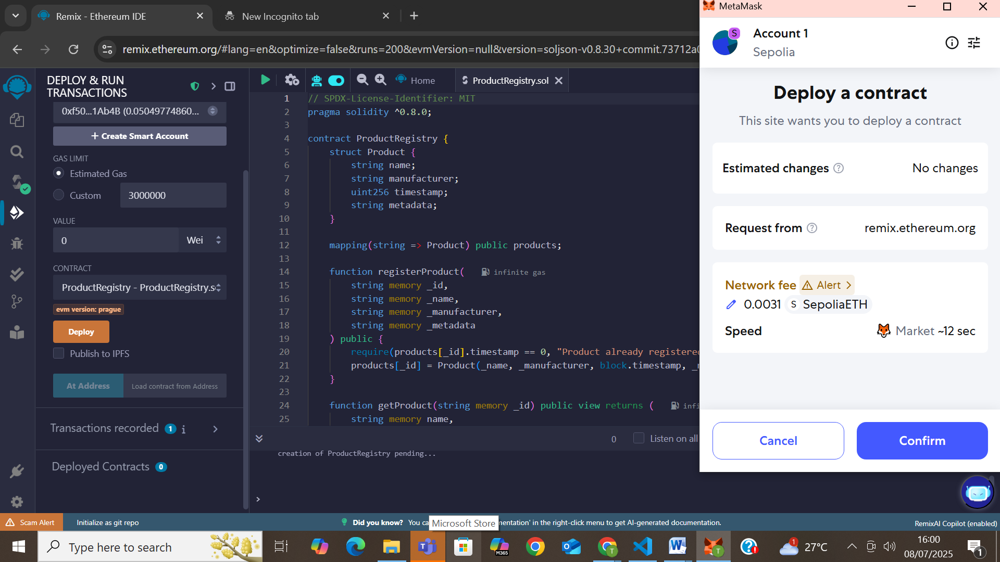
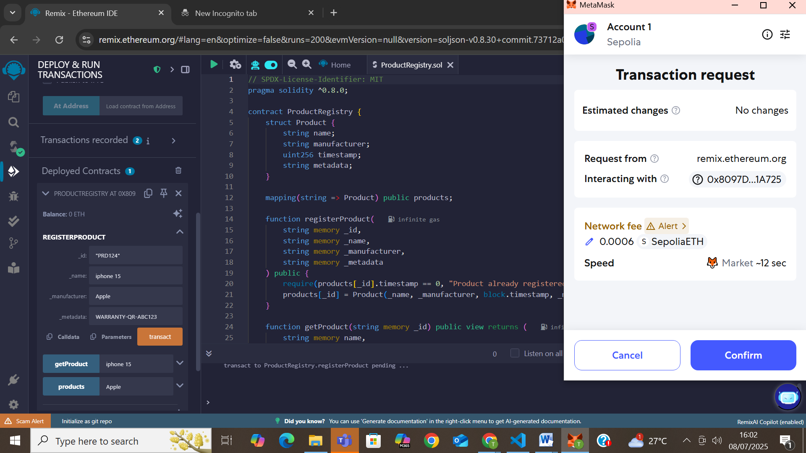
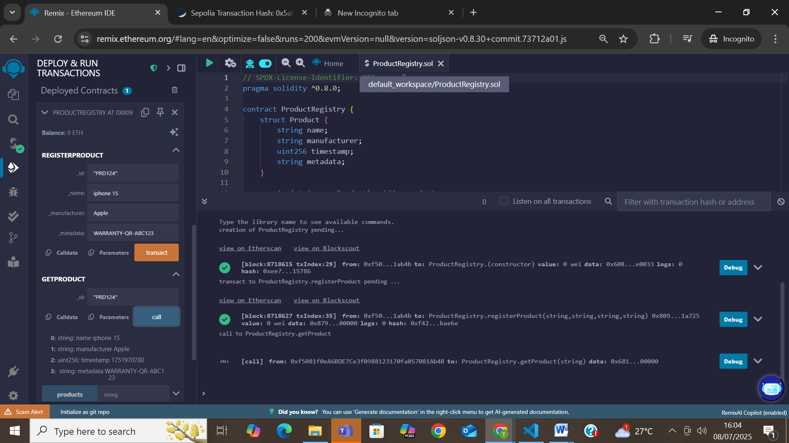
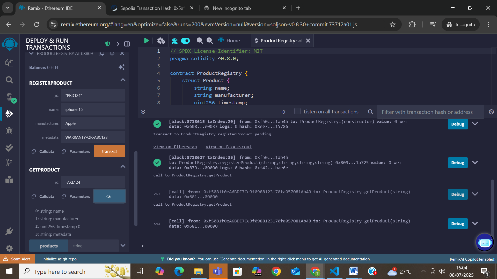

# Blockchain-Based Product Authentication
This repository contains the smart contract and supporting files for a blockchain-based product authentication system. The project demonstrates how to register and verify product authenticity using the Ethereum Sepolia Testnet and Solidity smart contracts

Repository Contents
- `ProductRegistry.sol`: Smart contract that allows product registration and verification by product ID.
- `register.png`: Screenshot showing successful product registration.
- `verify.png`: Screenshot showing successful product verification.

 Smart Contract Functions
- `registerProduct(string _id, string _name, string _manufacturer, string _metadata)`  
   Registers a new product if the product ID does not already exist.

- `getProduct(string _id)`  
   Retrieves product details for the given ID if it is registered.

 
 Sample Product (Used for Demo)
- Product ID: `PRD124`
- Name: `iPhone 15`
- Manufacturer: `Apple`
- Metadata: `WARRANTY-QR-ABC123`

Demo Screenshots
1.Deploy a contract

 
2 Register a product

3.Verify Product
Real Product
 

Fake Product:
 

 Author
**Tumma Srihita**  
M.Sc. (AI & ML)  
St. Francis College for Women  
